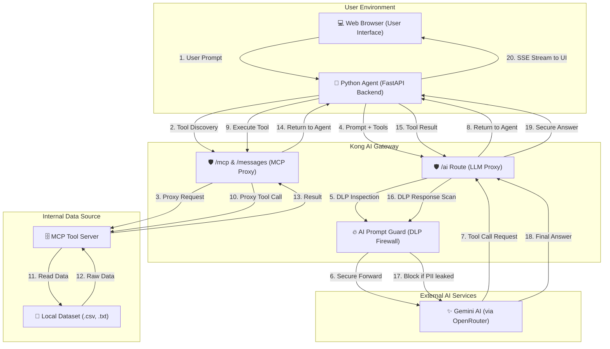

# Volvo DNS TAPIR - Secure AI-MCP Architecture Flow

This document outlines the secure data flow between the User, Kong AI Gateway, the LLM, and the local MCP Data Server.

## 1. System Architecture (Mermaid Diagram)

## 2. Detailed Step-by-Step Flow

### Phase A: Discovery & Submission
1. **User Input**: User enters a prompt in the Web UI (e.g., "Summarize the public policies").
2. **Agent Initialization**: The FastAPI backend (Agent) connects to Kong to discover what tools the MCP server provides.
3. **Discovery Proxy**: Kong proxies this request to the local MCP server and returns the tool schemas (e.g., `fetch_documents`, `list_available_files`).

### Phase B: LLM Reasoning (First Pass)
4. **LLM Request**: Agent sends the User's prompt + the Tool definitions to Kong's `/ai` route.
5. **DLP Check (Request)**: Kong's `ai-prompt-guard` scans the user's prompt. If it contains forbidden patterns (like a credit card number), Kong kills the request immediately.
6. **LLM Analysis**: If clean, the prompt reaches the LLM. The LLM realizes it needs data and returns a `tool_call` request (e.g., "I need to call `fetch_documents` for `public_policies.txt`").

### Phase C: Tool Execution & Security Scan
7. **Tool Fetch**: The Agent receives the tool call and executes it through Kong's MCP routes (`/mcp` and `/messages`).
8. **Data Retrieval**: The local MCP server reads the physical file from the `/data` directory.
9. **DLP Check (Response)**: The Agent sends the tool's output back to the LLM via Kong. **This is the critical step.** Kong scans the data extracted from the file. If the file contains PII (emails, phones) that shouldn't be shared with the cloud LLM, Kong **BLOCKS** the response.

### Phase D: Final Answer
10. **Final Response**: If the data is safe, the LLM receives it, generates a final human-readable answer, and sends it back through Kong.
11. **UI Update**: The Agent streams the final answer and each internal step to the UI for the user to see the "Request Journey."

## 3. Security Enforcement Summary

| Stage | Security Plugin | Action |
| :--- | :--- | :--- |
| **User Input** | `ai-prompt-guard` | Blocks prompt injections and sensitive data leaks from the user. |
| **Tool Data** | `ai-prompt-guard` | (Response mode) Blocks the LLM from seeing sensitive data found in local files. |
| **Redaction** | `ai-pii-sanitizer` | Automatically replaces PII with [REDACTED] tokens. |
| **Observability** | `file-log` | Creates a full GDPR-compliant audit trail of every AI interaction. |
